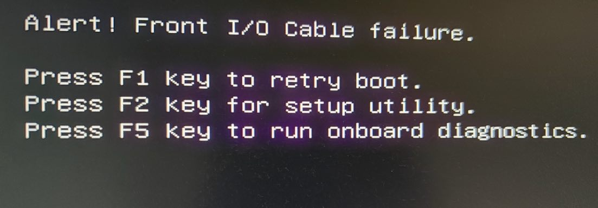
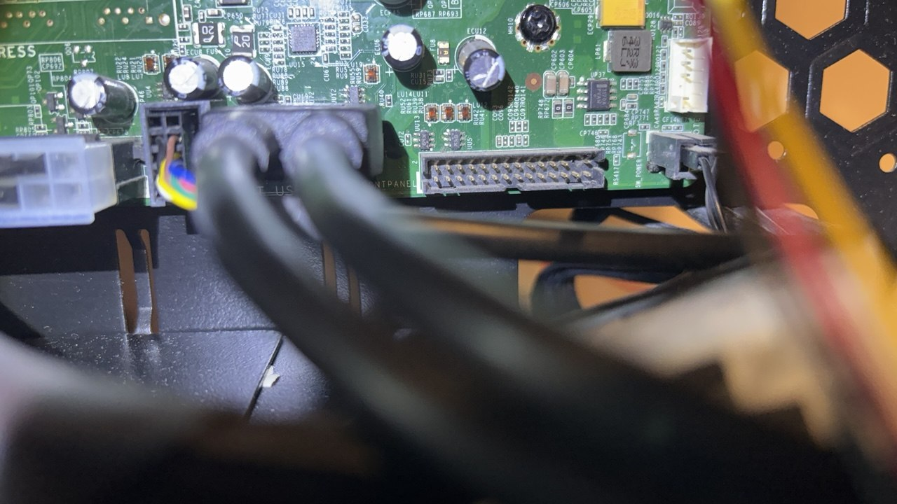
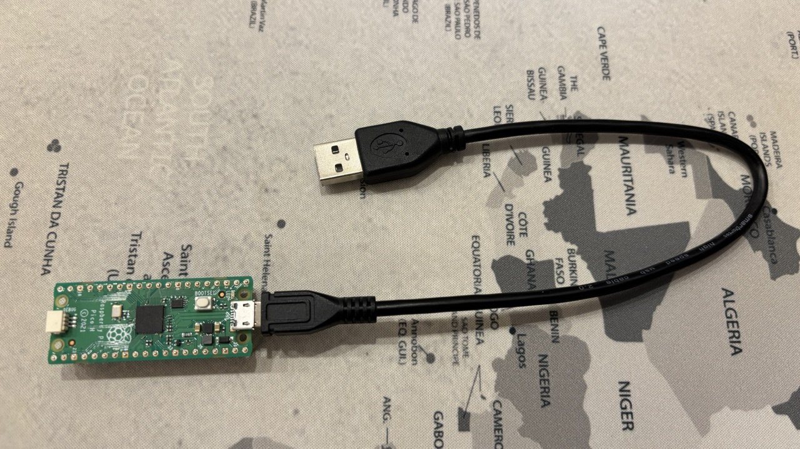
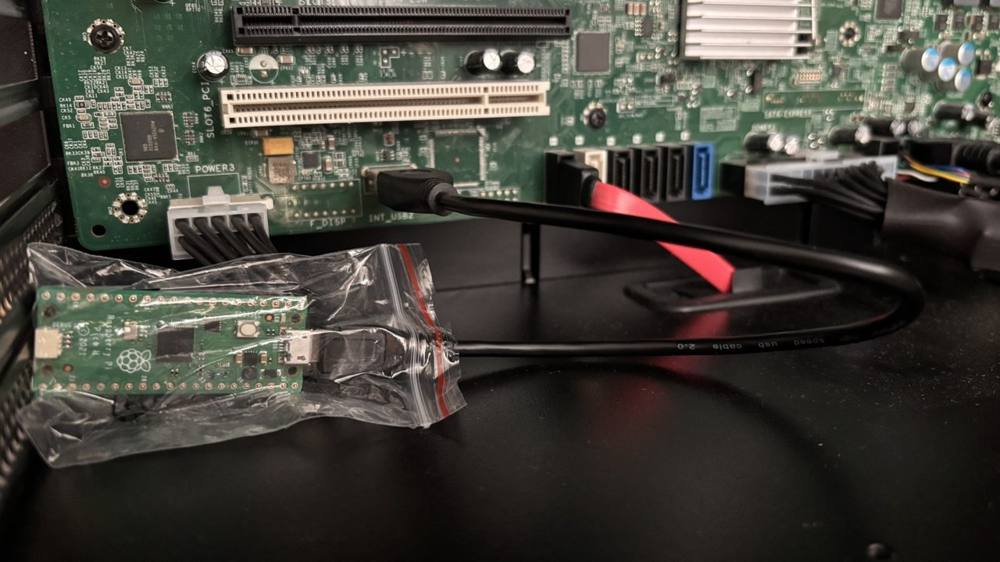

# Dell Precision T7810 bootloader fix
The project is aimed to fix the issue with the `Dell Precision T7810` motherboard bootloader if no official DELL case is available.

## Issue
The Dell Precision T7810 (as well as other versions, like T5810, etc) has a problem with the boot loader if some fan or front panel is not connected to the motherboard.

The `Alert! Front I/O Cable failure.` message is displayed after the boot:

So, you'll need to press `F1` key each time to confirm the booting.

In my case, it's not connected (absent because of unofficial PC-case):

## Solution
The workaround is to use any microcontroller board to emulate keyboard (`USB HID`).
The idea is to press the `F1` key virtually to continue the boot process.

The [Raspberry Pi Pico](https://www.raspberrypi.com/products/raspberry-pi-pico/) (RP2040) is used in this project:

## Installation
To install the solution follow the next steps.

### Step 1
Download latest [CircuitPython](https://circuitpython.org/board/raspberry_pi_pico/) `UF2` release (or see [files](files) folder).

### Step 2
Connect `RP2040` to USB holding `BOOTSEL` button on the board and move `adafruit-circuitpython-raspberry_pi_pico-*.uf2` file to opened USB storage.

### Step 3
Download latest [Adafruit CircuitPython Bundle](https://circuitpython.org/libraries) release (or see [files](files) folder).

### Step 4
Unpack and copy `lib/adafruit_hid` folder to `lib` folder of board.

### Step 5
Copy [code.py](code.py) to the root folder of the board.
Optionally, copy [boot.py](boot.py) to the root folder of the board and change it to your needs (for experts only).

### Step 6
Reboot the PC. It should be booted without additional interaction.

The final installation result looks like this:

## Reset
To reset `RP2040` to the original state follow the next steps.

### Step 1
Download [nuke_universal](https://learn.adafruit.com/getting-started-with-raspberry-pi-pico-circuitpython/circuitpython#flash-resetting-uf2-3083182) `UF2` file (or see [files](files) folder).

### Step 2
Connect `RP2040` to USB holding `BOOTSEL` button on the board and move `flash_nuke.uf2` file to opened USB storage. This will erase all files on the board.

## Reference
- [Dell Precision Tower 7810 Owner's Manual](https://dl.dell.com/content/manual26064352-dell-precision-tower-7810-owner-s-manual.pdf)
- [Raspberry Pi Pico and CircuitPython](https://cdn-learn.adafruit.com/downloads/pdf/getting-started-with-raspberry-pi-pico-circuitpython.pdf)

## Known issues
- The solution is not working on reboot, since USB-ports are initialized only on first boot. Use a rear motherboard USB port, avoid powered hubs, expect full power-off between boots.
- CircuitPython may show two USB drives from one Pico: `CIRCUITPY` (your files) and an empty SD-card slot (for an optional SD breakout - the Pico has no built-in slot). This is normal.

## Alternative solutions
There are some alternative methods to fix the issue, like:
1. Buy front-panel board, for example on [Aliexpress](https://www.aliexpress.com/item/1005003142913949.html) market or other.
2. Short-circuit some pins of [front-panel board socket](https://forum.overclockers.ua/viewtopic.php?t=226678&start=240) to disable hardware check.

## Contribution
Feel free to create an issue or a pull request if any ideas.

## Disclaimer
The source code of this repository is provided AS-IS and WITH NO WARRANTY of any kind.
Author and/or contributor are NOT responsible for any type of losses as a result of using source code, 
compiled binaries or other outcomes related to this repository.
